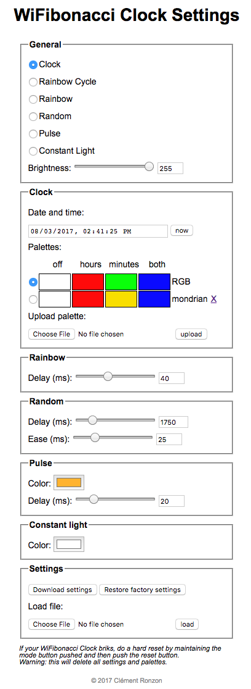
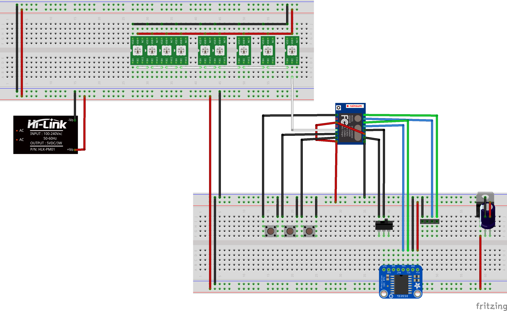

# WiFibonacci Clock

The WiFibonacci Clock is a modified version of the awesome Fibonacci Clock designed by [Philippe Chrétien](http://basbrun.com/).

## Enhancements

The main enhancement is the replacement of the Atmega328 with an [ESP8266](http://www.esp8266.com) providing WiFi capability. This is game-changing as we can now virtualize part of the physical UI having the ESP acting as a [Websocket](https://en.wikipedia.org/wiki/WebSocket) server. Furthermore, the dematerialization of the UI allows more tuning options.

The list of existing modes that Philippe included in his design are:

 - Current Time
 - Rainbow Cycle
 - Rainbow
 - Error Code Display

In the current design I chose to remove the Error Code Display mode and add the following list of new modes:

 - Random
 - Pulse
 - Constant Light
 
For each mode, several settings can be tweaked, see a screenshot of the virtual UI at the bottom of this page.

There is only two momentary buttons in my design:

 - Mode button
 - Brightness button
 
 The brightness is also an enhancement. The time adjustment can be done via the virtual UI.

## How to use it

Plug the clock to the power source

### How to access the virtual UI

 1. With you smart-phone, tablet, computer, etc. connect to the wifi signal named `WiFibonacciClk`, password is `fibonacci`.
 2. Open a browser and go to [http://192.168.4.1](http://192.168.4.1)
 3. The setings page should load by itself

### How to use the physical UI

 - Push sequentially the Mode button to cycle through the modes
 - Push an maintain pushed the Brightness button to dim down the LEDs. When you reach the lowest intensity, release the button and push it again to dim up the LEDs. The opposite happens when you reach the highest intensity.
 - Push the reset button to perform a soft reset. This will not erase the last settings saved in memory nor the palettes you might have uploaded to the clock.
 
### What should I do if the clock is not responding / gets bricked
 
If the clock gets stuck and keeps stuck or if you want to wipe out any custom settings and palettes there are two ways:
 - Enter the virtual UI and press the Reset Factory Settings button
 - Maintain the Mode button pressed and press the reset button

Caution: this will definitely erase the previous settings and the palettes you might have uploaded to the clock.
 
## Software design
 
The ESP's firmware is quite self explanatory. You will be able to get the `ino` files at the root of this repo.

The HTML UI is embedded inside the ESP's firmware but you can modify it following those simple steps:

 1. Install `npm` and `grunt` (documentation: [https://gruntjs.com/](https://gruntjs.com/))
 2. Install the dependencies, run in a terminal at the root of the project: `nom install`
 3. Modify client.html as you wish. Keep in mind that the resulting payload.html should be less than 3,000 characters
 4. Run `grunt` in the same terminal to generate the 4 parts needed in the `generated` folder. Copy their content and past it in WiFibonacciClock.ino as described below:
 
   - payload.html -> `UI_HTTP_PAYLOAD`
   - script.js -> `UI_JS_SCRIPT`
   - body.html -> `UI_HTML_BODY`
   - style.html -> `UI_HTML_STYLE`
   
 5. Save and upload your fimware to the ESP. `Rx`, `Tx` and `GND` are exposed via male headers as well as a programing rocker switch.
 
## Hardware design
 
I used [Fritzing](http://fritzing.org) to draw the electronic diagram (see breadboard below).

I followed the instructions provided by Philippe to build the enclosure.

## Feel free

If you want to reproduce, modify or enhance my variation of this fabulous clock, feel free to do it respecting the licence enclosed in this repo.

If you detect a bug or a possible enhancement to the code, feel free to send me a merge request, open an issue or leave a comment!

Thanks!

## Screenshots
 
 Virtual UI:
 
 
 
 Electronic design:
 
 
